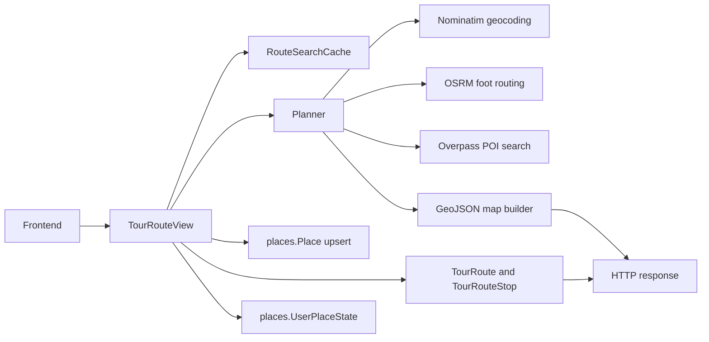
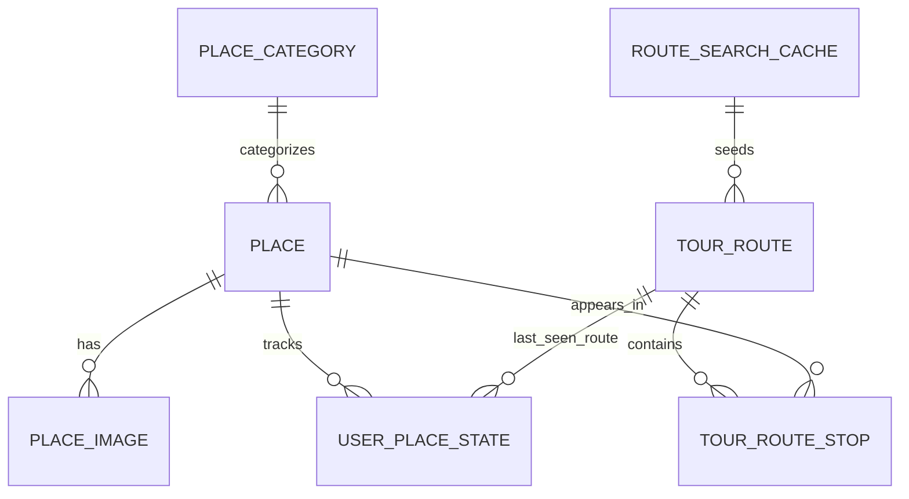

# Explora+ Backend

Backend principal do projeto Explora+, construido com Django, Django REST Framework e PostGIS.

Este repositorio concentra:

- autenticacao JWT
- catalogo canonico de lugares
- planejamento de rotas turisticas
- cache tecnico de consultas externas
- historico/rota atual do usuario
- biblioteca pessoal de POIs vistos em rotas

Hoje, o backend ativo gira em torno de `accounts + places + tour_routes + core + tickets`.

## Sumario

- [Visao Geral](#visao-geral)
- [Stack e dependencias](#stack-e-dependencias)
- [Estrutura do repositorio](#estrutura-do-repositorio)
- [Arquitetura ativa](#arquitetura-ativa)
- [Modelo de dados](#modelo-de-dados)
- [Fluxo da rota turistica](#fluxo-da-rota-turistica)
- [Subindo o projeto](#subindo-o-projeto)
- [Variaveis de ambiente](#variaveis-de-ambiente)
- [Comandos uteis](#comandos-uteis)
- [Endpoints](#endpoints)
- [Seeds e dados de demonstracao](#seeds-e-dados-de-demonstracao)
- [Testes e verificacoes](#testes-e-verificacoes)
- [Observacoes importantes](#observacoes-importantes)
- [Problemas comuns](#problemas-comuns)

## Visao Geral

O backend foi reorganizado para ter um dominio canonico de lugares e um dominio separado de rotas:

- `places` e a fonte unica de verdade para lugares e POIs.
- `tour_routes` e a feature de planejamento/personalizacao de rotas.
- `accounts` cuida do contrato de autenticacao e usuario atual.
- `tickets` continua presente, mas hoje esta isolado do fluxo principal do MVP.
- `routes` ainda existe em disco como legado, mas saiu do caminho ativo do sistema.

Na pratica, qualquer POI descoberto pelo planner passa a ser materializado em `places.Place`, em vez de ficar num catalogo paralelo.

## Stack e dependencias

### Linguagem e framework

- Python 3.x
- Django 5.1.4
- Django REST Framework 3.15.2
- SimpleJWT 5.3.1

### Banco e GIS

- PostgreSQL
- PostGIS
- `django.contrib.gis`

### Infra local

- Docker
- Docker Compose

### Bibliotecas principais

Arquivo: [requirements.txt](/C:/Users/lucas/Documents/Projects/academic/PCE/explora-plus-backend/requirements.txt)

- `Django==5.1.4`
- `djangorestframework==3.15.2`
- `djangorestframework-simplejwt==5.3.1`
- `psycopg2-binary==2.9.10`
- `django-cors-headers==4.6.0`
- `python-decouple==3.8`
- `gunicorn==23.0.0`

## Estrutura do repositorio

```text
explora-plus-backend/
|-- accounts/              # registro, login, refresh, /api/me/
|-- core/                  # health check e constantes de dominio
|-- docs/                  # documentacao tecnica complementar
|-- explora_plus/          # configuracao Django e roteamento raiz
|   `-- settings/
|       |-- base.py
|       |-- docker.py
|       `-- test.py
|-- places/                # dominio canonico de lugares e estados do usuario
|   `-- management/commands/
|       `-- seed_demo.py   # dados curados de demonstracao
|-- tickets/               # endpoint isolado de ingressos mockados
|-- tour_routes/           # planner, cache, rota atual, biblioteca do usuario
|   |-- services/          # geocoding, routing, Overpass, OSM, map builder
|   `-- tests/             # testes do fluxo de rotas
|-- routes/                # legado, fora do caminho ativo
|-- docker-compose.yml
|-- Dockerfile
|-- entrypoint.sh
|-- manage.py
`-- TODO.md
```

## Arquitetura ativa

### Apps ativos hoje

| App | Papel | Situacao |
| --- | --- | --- |
| `accounts` | registro, login, refresh, `/api/me/` | ativo |
| `core` | health check e constantes compartilhadas | ativo |
| `places` | dominio canonico de lugar/POI | ativo |
| `tour_routes` | planejamento, cache, rota atual, biblioteca pessoal | ativo |
| `tickets` | endpoint isolado, mockado | ativo, mas periferico |
| `routes` | modelagem antiga de rotas | legado, fora do fluxo ativo |

### Settings

O projeto usa pacote de settings:

- [base.py](/C:/Users/lucas/Documents/Projects/academic/PCE/explora-plus-backend/explora_plus/settings/base.py)
- [docker.py](/C:/Users/lucas/Documents/Projects/academic/PCE/explora-plus-backend/explora_plus/settings/docker.py)
- [test.py](/C:/Users/lucas/Documents/Projects/academic/PCE/explora-plus-backend/explora_plus/settings/test.py)

`manage.py` aponta por padrao para `explora_plus.settings.docker`, entao o caminho esperado de desenvolvimento e Docker + PostGIS.

Arquivo: [manage.py](/C:/Users/lucas/Documents/Projects/academic/PCE/explora-plus-backend/manage.py)

### Fluxo de alto nivel



## Modelo de dados

### ER principal



### Dominio `places`

Arquivo: [places/models.py](/C:/Users/lucas/Documents/Projects/academic/PCE/explora-plus-backend/places/models.py)

#### `PlaceCategory`

Taxonomia canonica atual:

- `culture`
- `park`
- `food`

Campos principais:

- `slug`
- `name`
- `icon_name`
- `is_active`

#### `Place`

Tabela canonica de lugar/POI, usada tanto para conteudo curado quanto para POIs descobertos via APIs externas.

Campos importantes:

- identidade e navegacao
  - `slug`
  - `name`
  - `category`
- editorial
  - `description`
  - `summary`
  - `is_curated`
- origem externa
  - `source`
  - `source_ref`
  - `osm_type`
  - `osm_id`
  - `wikidata_id`
  - `wikipedia_title`
- localizacao
  - `location` (`PointField`)
  - `address`
- enriquecimento
  - `opening_hours`
  - `source_url`
  - `website`
  - `detail_status`
  - `raw_payload`
  - `details_fetched_at`
- monetizacao/evento
  - `price_cents`
  - `currency`
  - `event_start_at`
  - `event_end_at`
- controle
  - `is_active`
  - `created_at`
  - `updated_at`

#### `PlaceImage`

Imagens de um lugar. Tanto lugares curados quanto lugares enriquecidos externamente podem ter imagens aqui.

Campos:

- `place`
- `url`
- `order`
- `caption`

#### `UserPlaceState`

Estado global de um usuario em relacao a um lugar.

Campos:

- `user`
- `place`
- `is_visited`
- `visited_at`
- `first_seen_at`
- `last_seen_at`
- `seen_count`
- `last_seen_route`

Esse model e o que sustenta o conceito de "ja visitado" no app.

### Dominio `tour_routes`

Arquivo: [tour_routes/models.py](/C:/Users/lucas/Documents/Projects/academic/PCE/explora-plus-backend/tour_routes/models.py)

#### `RouteSearchCache`

Cache tecnico da busca.

Guarda:

- chave canonica da consulta
- origem e destino normalizados
- payload-base da rota
- payload-base do mapa
- contagem de hits

Esse cache nao e a fonte principal de verdade do dominio do usuario. Ele existe para:

- evitar recalculos desnecessarios
- servir de base para personalizacao posterior
- permitir reconstituir rotas com exclusoes/visitados

#### `TourRoute`

Snapshot relacional da rota do usuario.

Campos principais:

- `user`
- `search_cache`
- `origin_query`
- `destination_query`
- `origin_label`
- `destination_label`
- `origin_location`
- `destination_location`
- `mode`
- `distance_m`
- `duration_s`
- `direct_distance_m`
- `direct_duration_s`
- `route_geometry`
- `direct_route_geometry`
- `created_at`
- `updated_at`

`mode` hoje assume:

- `tour`
- `direct_fallback`

#### `TourRouteStop`

Lista relacional de stops da rota.

Campos principais:

- `route`
- `place`
- `display_order`
- `waypoint_order`
- `state`
- `source`
- `distance_from_route_m`

Estados atuais:

- `active`
- `visited`
- `excluded`

Interpretacao:

- `active`: aparece e continua na linha ativa da rota
- `visited`: aparece, mas sai da linha ativa
- `excluded`: some da rota atual, mas pode continuar registrado historicamente

### Como os IDs se relacionam

Esse ponto e importante para entender o projeto de ponta a ponta:

- o identificador publico do planner e `stop_id`
- internamente, esse `stop_id` e materializado em `Place.source_ref`
- `TourRouteStop.place` aponta para o `Place` canonico
- `UserPlaceState.place` aponta para o mesmo `Place`
- o frontend sempre conversa em termos de `stop_id`, mas o banco conversa em termos de `Place`

Em outras palavras:

- `stop_id` no wire
- `source_ref` no dominio canonico
- `place_id` nas relacoes do banco

Isso e o que permite que:

- o planner encontre um POI
- o detalhe do POI fique salvo no lugar canonico
- o usuario marque esse lugar como visitado globalmente
- a rota atual continue sendo personalizada por stop

### Dominio `tickets`

Arquivo: [tickets/views.py](/C:/Users/lucas/Documents/Projects/academic/PCE/explora-plus-backend/tickets/views.py)

Hoje `tickets` nao faz parte do coracao da entrega:

- `GET /api/tickets/` retorna lista vazia
- `POST /api/tickets/` retorna `201` mockado

Ele continua no repo, mas esta isolado.

## Fluxo da rota turistica

### Planejamento base

1. O frontend chama `POST /api/tour-routes/`.
2. O backend normaliza origem e destino.
3. E montada uma chave canonica de cache.
4. Se houver cache valido, ele e reaproveitado.
5. Se nao houver, o planner:
   - geocodifica origem/destino
   - calcula a rota pedestre base
   - busca POIs proximos
   - seleciona os POIs relevantes
   - monta o `route` + `map`
6. Todo POI encontrado e materializado em `places.Place`.
7. Se o usuario estiver autenticado:
   - a rota e persistida como `TourRoute`
   - os stops sao persistidos como `TourRouteStop`
   - a biblioteca pessoal e atualizada via `UserPlaceState`
8. A resposta publica e devolvida no contrato esperado pelo frontend.

### Personalizacao

Quando o usuario personaliza a rota:

- marcar como visitado altera `UserPlaceState`
- excluir da rota altera `TourRouteStop.state`
- a resposta publicada e sempre reconstruida a partir do modelo relacional

### Detalhe de POI

Ao abrir um POI:

1. o frontend chama `GET /api/tour-routes/pois/<stop_id>/`
2. o backend procura o `Place` canonico por `source_ref`
3. se os detalhes ainda nao estiverem completos, ele tenta enriquecer via fontes externas na seguinte ordem:
   - Nominatim: endereco, website, horarios, `wikipedia_title`, `wikidata_id` via extratags OSM
   - Wikidata: imagem principal (propriedade P18) e titulo Wikipedia alternativo
   - Se ainda nao houver `wikipedia_title`, pesquisa o Wikipedia por nome do lugar (pt → en)
   - Wikipedia: descricao, imagem e URL canonica do artigo
4. os novos dados ficam salvos no proprio `Place`

## Subindo o projeto

### Caminho recomendado: Docker

Esse e o caminho suportado e validado para desenvolvimento local.

#### 1. Criar arquivo `.env`

Copie [`.env.example`](/C:/Users/lucas/Documents/Projects/academic/PCE/explora-plus-backend/.env.example) para `.env`.

Exemplo:

```env
DB_NAME=explora_plus
DB_USER=explora_user
DB_PASSWORD=explora_pass
DB_HOST=db
DB_PORT=5432
DJANGO_SECRET_KEY=change-me-in-production-use-a-long-random-string
DJANGO_DEBUG=True
DJANGO_ALLOWED_HOSTS=localhost,127.0.0.1,backend
```

#### 2. Subir containers

```bash
docker compose up --build -d
```

#### 3. Aplicar migracoes

```bash
docker compose exec backend python manage.py migrate
```

#### 4. Opcional: popular lugares curados de demonstracao

```bash
docker compose exec backend python manage.py seed_demo --reset
```

#### 5. Verificar saude do backend

URL esperada:

- [http://localhost:8080/api/health/](http://localhost:8080/api/health/)

Resposta esperada:

```json
{
  "status": "ok",
  "db": "ok",
  "postgis": "..."
}
```

### Portas locais

Definidas em [docker-compose.yml](/C:/Users/lucas/Documents/Projects/academic/PCE/explora-plus-backend/docker-compose.yml):

- backend HTTP: `localhost:8080`
- PostgreSQL/PostGIS: `localhost:5433`

### Rodar sem Docker

Nao e o caminho principal deste projeto.

Para rodar fora do Docker, voce precisaria alinhar manualmente:

- PostgreSQL + PostGIS
- bibliotecas GIS nativas
- compatibilidade de `django.contrib.gis`

Hoje a documentacao e o fluxo de equipe assumem Docker como ambiente principal do backend.

## Variaveis de ambiente

Arquivo base: [`.env.example`](/C:/Users/lucas/Documents/Projects/academic/PCE/explora-plus-backend/.env.example)

| Variavel | Obrigatoria | Exemplo | Papel |
| --- | --- | --- | --- |
| `DB_NAME` | sim | `explora_plus` | nome do banco |
| `DB_USER` | sim | `explora_user` | usuario do Postgres |
| `DB_PASSWORD` | sim | `explora_pass` | senha do Postgres |
| `DB_HOST` | sim | `db` | host do banco dentro do Compose |
| `DB_PORT` | sim | `5432` | porta do banco dentro do Compose |
| `DJANGO_SECRET_KEY` | sim | `change-me...` | chave secreta do Django |
| `DJANGO_DEBUG` | sim | `True` | ativa modo debug |
| `DJANGO_ALLOWED_HOSTS` | sim | `localhost,127.0.0.1,backend` | hosts aceitos pelo Django |

## Comandos uteis

### Infra

```bash
docker compose up --build -d
docker compose down
docker compose down -v
docker compose logs -f backend
docker compose logs -f db
```

### Django

```bash
docker compose exec backend python manage.py migrate
docker compose exec backend python manage.py makemigrations
docker compose exec backend python manage.py createsuperuser
docker compose exec backend python manage.py shell
```

### Seeds

```bash
docker compose exec backend python manage.py seed_demo --reset
```

### Testes

```bash
docker compose exec backend python manage.py test tour_routes.tests --settings=tour_routes.test_settings --verbosity 2 --noinput
```

### Verificacoes de estrutura

```bash
docker compose exec backend python manage.py makemigrations --check --dry-run
```

## Endpoints

Arquivo raiz de rotas: [explora_plus/urls.py](/C:/Users/lucas/Documents/Projects/academic/PCE/explora-plus-backend/explora_plus/urls.py)

### Health

| Metodo | Rota | Auth | Papel |
| --- | --- | --- | --- |
| `GET` | `/api/health/` | nao | status da API, banco e PostGIS |

### Admin

| Rota | Papel |
| --- | --- |
| `/admin/` | admin padrao do Django |

### Accounts

Arquivo: [accounts/urls.py](/C:/Users/lucas/Documents/Projects/academic/PCE/explora-plus-backend/accounts/urls.py)

| Metodo | Rota | Auth | Papel |
| --- | --- | --- | --- |
| `POST` | `/api/auth/register/` | nao | cria usuario e devolve `access + refresh` |
| `POST` | `/api/auth/login/` | nao | login JWT |
| `POST` | `/api/auth/refresh/` | nao | renova access token |
| `GET` | `/api/me/` | sim | usuario atual |

### Places

Arquivo: [places/urls.py](/C:/Users/lucas/Documents/Projects/academic/PCE/explora-plus-backend/places/urls.py)

| Metodo | Rota | Auth | Papel |
| --- | --- | --- | --- |
| `GET` | `/api/places/` | nao | lista lugares ativos |
| `GET` | `/api/places/<slug>/` | nao | detalhe de lugar |

Observacao importante:

- o endpoint e legado/compatibilidade
- ele continua lendo da tabela canonica `Place`
- o payload ainda usa campos como `kind`, `about`, `hours`, `priceLabel`

### Tour Routes

Arquivo: [tour_routes/urls.py](/C:/Users/lucas/Documents/Projects/academic/PCE/explora-plus-backend/tour_routes/urls.py)

| Metodo | Rota | Auth | Papel |
| --- | --- | --- | --- |
| `POST` | `/api/tour-routes/` | opcional | calcula rota, usa cache, salva rota se autenticado |
| `GET` | `/api/tour-routes/current/` | sim | abre a rota mais recente do usuario |
| `GET` | `/api/tour-routes/places/` | sim | biblioteca pessoal de lugares do usuario |
| `GET` | `/api/tour-routes/pois/<stop_id>/` | nao | detalhe enriquecido de um POI |
| `PATCH` | `/api/tour-routes/places/<stop_id>/visited/` | sim | marca/desmarca visitado globalmente |
| `DELETE` | `/api/tour-routes/saved/<route_id>/stops/<stop_id>/` | sim | exclui stop da rota atual |
| `PATCH` | `/api/tour-routes/saved/<route_id>/stops/<stop_id>/state/` | sim | muda estado publico do stop |

Para o contrato detalhado do planner, veja:

- [docs/tour-routes-api.md](/C:/Users/lucas/Documents/Projects/academic/PCE/explora-plus-backend/docs/tour-routes-api.md)

### Tickets

Arquivo: [tickets/urls.py](/C:/Users/lucas/Documents/Projects/academic/PCE/explora-plus-backend/tickets/urls.py)

| Metodo | Rota | Auth | Papel |
| --- | --- | --- | --- |
| `GET` | `/api/tickets/` | sim | historico mockado |
| `POST` | `/api/tickets/` | sim | compra mockada |

## Seeds e dados de demonstracao

Arquivo: [places/management/commands/seed_demo.py](/C:/Users/lucas/Documents/Projects/academic/PCE/explora-plus-backend/places/management/commands/seed_demo.py)

O comando `seed_demo` popula:

- categorias canonicas:
  - `culture`
  - `park`
  - `food`
- lugares curados de Santos
- imagens de exemplo por URL

Uso:

```bash
docker compose exec backend python manage.py seed_demo --reset
```

O `--reset` apaga `PlaceImage` e `Place` antes de repopular.

## Testes e verificacoes

### Suite mais importante hoje

O miolo mais sensivel do projeto esta em `tour_routes`.

Comando:

```bash
docker compose exec backend python manage.py test tour_routes.tests --settings=tour_routes.test_settings --verbosity 2 --noinput
```

### O que vale conferir antes de subir mudancas

```bash
docker compose exec backend python manage.py makemigrations --check --dry-run
docker compose exec backend python manage.py test tour_routes.tests --settings=tour_routes.test_settings --verbosity 2 --noinput
```

### Quando fizer alteracoes de banco

Sequencia segura:

```bash
docker compose exec backend python manage.py makemigrations
docker compose exec backend python manage.py migrate
docker compose exec backend python manage.py makemigrations --check --dry-run
```

## Observacoes importantes

### `routes` e legado

O diretorio [routes](/C:/Users/lucas/Documents/Projects/academic/PCE/explora-plus-backend/routes) ainda existe no repo, mas:

- nao esta em `INSTALLED_APPS`
- nao esta incluido em [explora_plus/urls.py](/C:/Users/lucas/Documents/Projects/academic/PCE/explora-plus-backend/explora_plus/urls.py)
- nao deve receber novas features

### O catalogo de lugares e unico

Hoje o backend nao deveria criar um catalogo paralelo para planner.

Se um POI aparecer numa rota, o lugar deve existir em `places.Place`.

### Compatibilidade com frontend legado

O frontend visivel do MVP usa `tour_routes`, mas o backend ainda mantem `/api/places/` para compatibilidade.

Isso significa que existem dois contratos HTTP publicos coexistindo:

- contrato novo, rico, centrado em `tour_routes`
- contrato legado, simplificado, centrado em `/api/places/`

### Fontes externas envolvidas no planner

O fluxo de rotas e detalhes depende de provedores externos:

- geocoding: Nominatim
- roteamento pedestre: OSRM
- busca de POIs: Overpass
- detalhe complementar: Nominatim (extratags), Wikidata (imagem P18), Wikipedia (descricao e imagem)

O enriquecimento de detalhe usa um fallback progressivo: se o lugar OSM nao tiver `wikidata`/`wikipedia` nos extratags, o backend pesquisa o Wikipedia diretamente pelo nome do lugar (primeiro em portugues, depois em ingles). Isso garante cobertura para lugares sem dados completos no OSM.

## Problemas comuns

### 1. `relation ... does not exist`

Causa comum:

- migracao nao aplicada no banco do Docker

Correcao:

```bash
docker compose exec backend python manage.py migrate
```

### 2. `Given token not valid for any token type`

No frontend atual, tokens velhos podem acontecer quando a sessao local expira.

Fluxo esperado:

- o frontend tenta `refresh`
- se falhar, ele limpa a sessao e volta para login

Se precisar, faca logout/login novamente.

### 3. Backend sobe, mas `/api/health/` acusa erro de banco

Cheque:

- container `db` saudavel
- `.env` correto
- portas livres
- PostGIS iniciado

Comandos:

```bash
docker compose ps
docker compose logs -f db
docker compose logs -f backend
```

### 4. Rodar sem Docker falha por GIS

Hoje isso e esperado caso o ambiente local nao tenha stack GIS pronta.

Recomendacao:

- use Docker

## Documentacao complementar

- [Backend architecture](/C:/Users/lucas/Documents/Projects/academic/PCE/explora-plus-backend/docs/backend-architecture.md)
- [Tour routes API](/C:/Users/lucas/Documents/Projects/academic/PCE/explora-plus-backend/docs/tour-routes-api.md)
- [TODO atual](/C:/Users/lucas/Documents/Projects/academic/PCE/explora-plus-backend/TODO.md)

## Repos relacionados

Este backend trabalha em conjunto com:

- `explora-plus-frontend`
- `explora-plus-docs`

Se voce estiver fazendo onboarding no sistema inteiro, o ideal e ler este README junto com o README do frontend.
