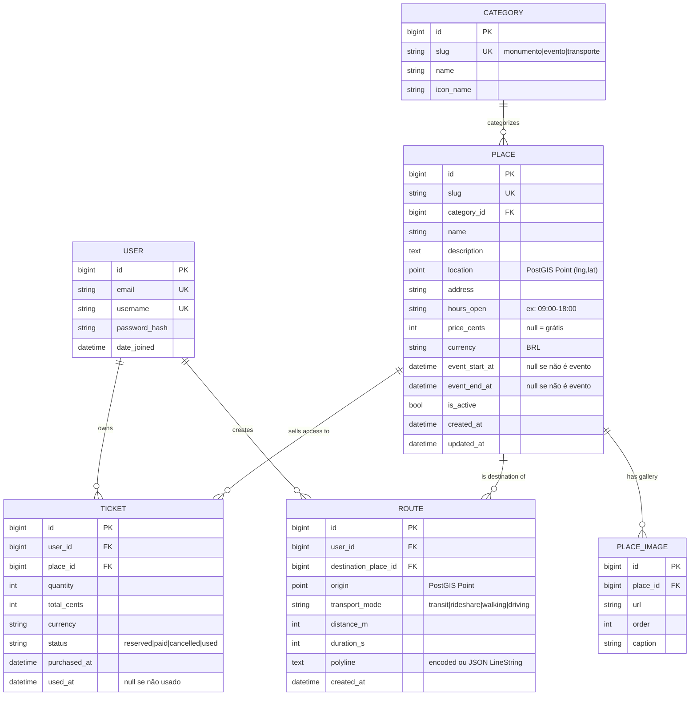
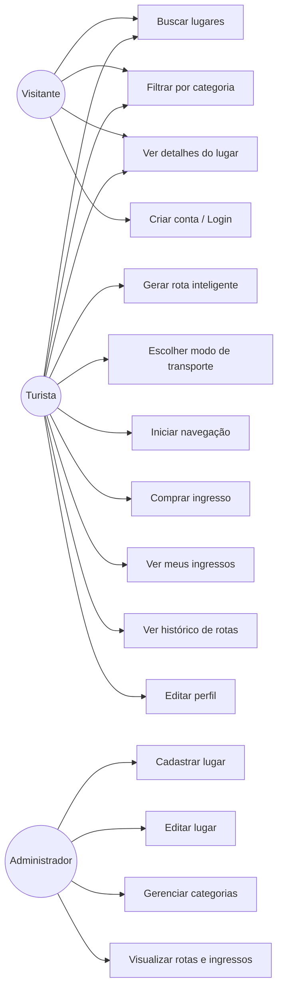
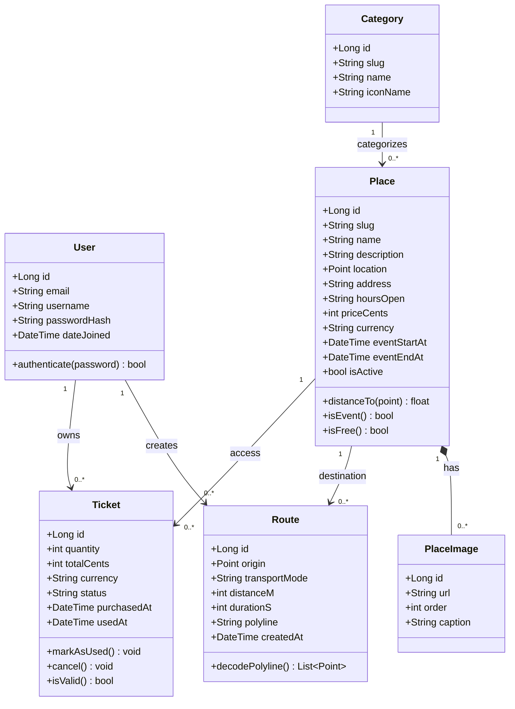
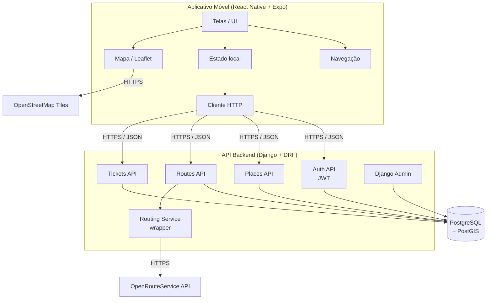
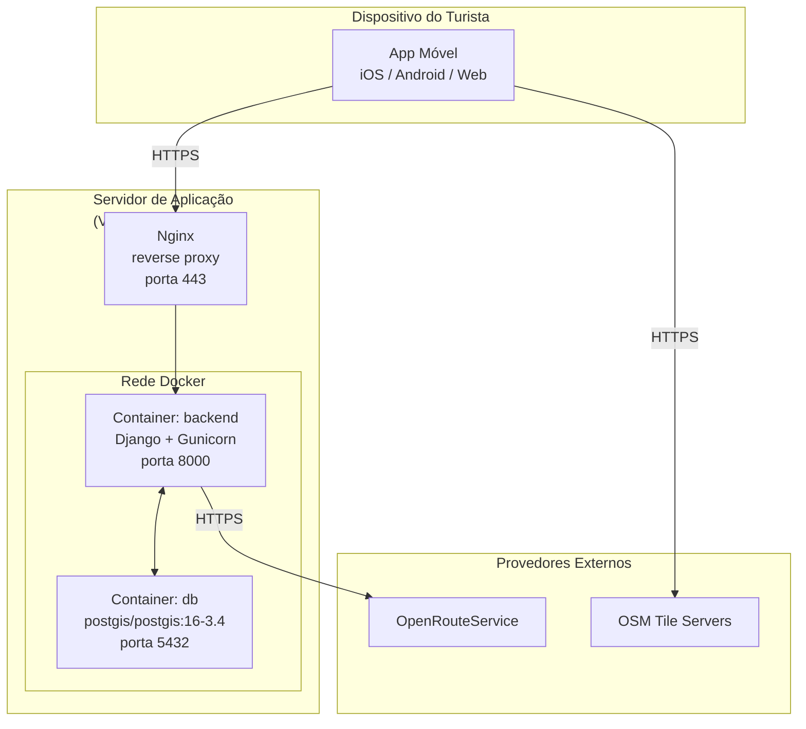
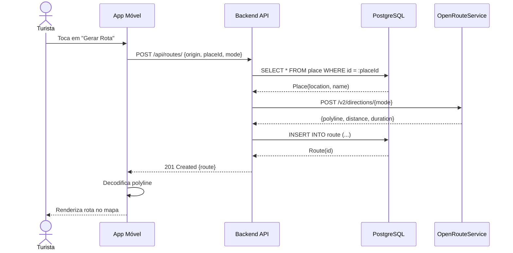
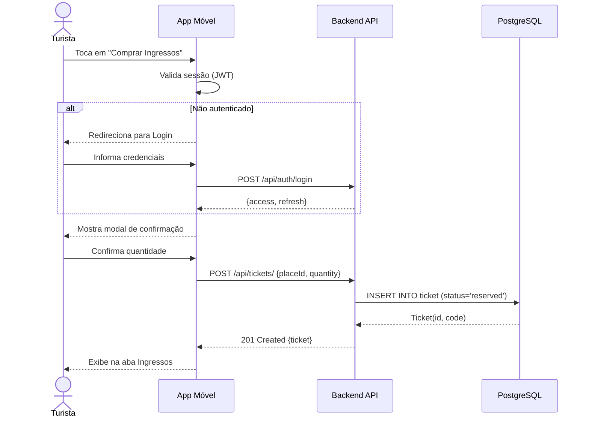
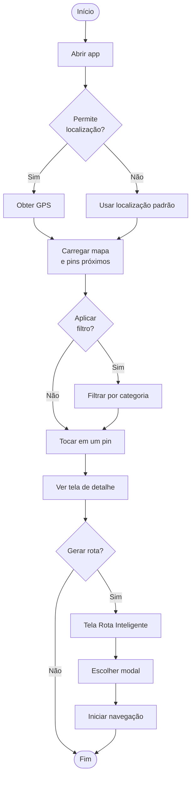
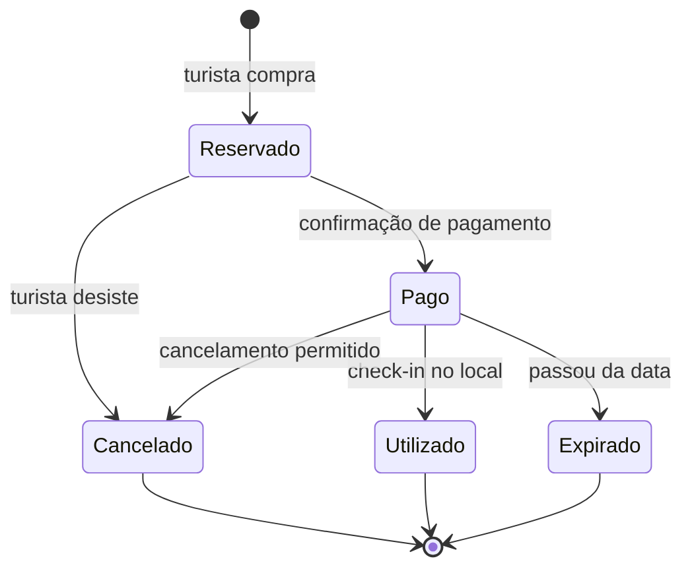

# Backend — TODO (MVP)

> Foco: entregar o mínimo viável conectado ao frontend. Conteúdo só em **português**, sem i18n. Funcionalidades opcionais movidas pra "Pós-MVP" no final.

---

## Estado atual

- Django 5.1 + DRF + simplejwt + cors-headers + python-decouple
- Postgres + PostGIS (`django.contrib.gis` no `INSTALLED_APPS`, engine `postgis`)
- App `core` vazio (só `health_check`)
- Sem models, sem migrations, sem endpoints REST de domínio, sem auth views

---

## Modelagem MVP (ER)

### Resumo das entidades

| Entidade | Por que existe no MVP |
|---|---|
| **User** (Django nativo) | autenticação, dono de rotas e ingressos |
| **Category** | popula os chips de filtro (Monumentos / Eventos / Transporte) |
| **Place** | unidade central do app. Contém localização PostGIS, conteúdo (PT), preço, e *opcionalmente* janela temporal pra eventos (`event_start_at` / `event_end_at` nullable — assim "evento" é só um Place com data) |
| **PlaceImage** | a tela Detalhe tem carousel de N imagens |
| **Route** | "Rota Inteligente" salva: origem, destino, modal, polyline, duração, distância |
| **Ticket** | aba Ingressos: histórico de compras com status |

### Decisões já tomadas (MVP)

- **Sem i18n**: tudo em PT, campo único `name`/`description` no Place
- **Evento ≠ tabela separada**: campos nullable no Place
- **Rota single-destination**: sem tabela `RouteWaypoint` — destino é um único `Place`
- **Sem Favorite, sem UserProfile**: cortados do MVP
- **Sem PlaceTranslation**: cortado junto com i18n
- **Polyline na Route**: campo `text` (encoded polyline) — mais barato de armazenar e o frontend decoda

### Decisões abertas

1. **Hours_open**: string simples (`"09:00-18:00"`) vs JSON estruturado (`{"mon": "09:00-18:00", "sun": "closed"}`)? Recomendo string simples no MVP.
2. **Pagamento de Ticket**: precisa integrar gateway agora ou marca como "reservado" sem cobrar de verdade? Recomendo mock no MVP — só salva o registro.

---

## Diagramas UML

### Casos de Uso

### Classes

### Componentes

### Implantação

### Sequência — Gerar Rota

### Sequência — Compra de Ingresso

### Atividade — Explorar e Gerar Rota

### Estados — Ciclo do Ticket

---

## Backlog de implementação (ordem sugerida)

### 1. Apps a criar
- [ ] `places` — `Category`, `Place`, `PlaceImage`
- [ ] `routes` — `Route`
- [ ] `tickets` — `Ticket`
- [ ] `accounts` (ou usar User direto sem app dedicado)

### 2. Auth
- [ ] Endpoints `/api/auth/register`, `/api/auth/login`, `/api/auth/refresh` (simplejwt)
- [ ] Endpoint `/api/me/` (dados básicos do user)

### 3. Domínio
- [ ] CRUD `/api/places/` com filtros (`?category=monumento&near=lat,lng&radius_km=...`)
- [ ] `/api/places/<slug>/` (detalhe com imagens)
- [ ] `/api/routes/` POST (gerar rota) + GET (histórico do usuário)
- [ ] `/api/tickets/` GET (histórico) + POST (compra mockada — só persiste)

### 4. Roteamento (Smart Route)
- [ ] Definir provedor (sugestão: **OpenRouteService** — free 2k req/dia, sem cartão)
- [ ] Wrapper Python no backend que chama o provedor e devolve polyline + duração + distância
- [ ] Cache de resultados no DB pra economizar quota
- [ ] *MVP simplificado*: pode começar devolvendo só distância em linha reta e duração estimada por modal, sem chamar API externa ainda

### 5. Admin
- [ ] Customizar admin pra cadastrar Place com inline de PlaceImage
- [ ] Mapa do PostGIS no admin (`OSMGeoAdmin`) pra clicar e marcar o pin

### 6. Seed
- [ ] Management command `seed_demo` que popula Categories + ~10 Places de Santos

### 7. Substituir mocks do frontend
Quando os endpoints estiverem prontos:
- [ ] `src/data/places.ts` → `/api/places`
- [ ] `src/data/mockRoutes.ts` → `/api/routes/`
- [ ] `src/data/mockTickets.ts` → `/api/tickets/`
- [ ] `src/data/mockUser.ts` → `/api/me/`

---

## Pós-MVP (backlog parcial)

Itens que existiam no ER original e foram cortados pro MVP. Reincluir quando fizer sentido:

- **Internacionalização** (PT/EN/ES): voltar tabela `PlaceTranslation` + campo `preferred_language` no `UserProfile` + middleware que lê `Accept-Language`
- **Multi-waypoint nas rotas**: tabela `RouteWaypoint` (place_id + order) + endpoint `/optimization` do provedor de roteamento
- **Favoritos**: tabela `Favorite` (user + place), tela dedicada, botão de favoritar no PlaceDetail
- **UserProfile**: extensão 1-1 com avatar customizado, preferências, biografia
- **Reviews / Avaliações**: tabela `Review` (user + place + rating + comment)
- **Pagamento real de Ingressos**: integração com Stripe / Mercado Pago
- **Notificações push**: Expo Notifications + backend pra disparar
